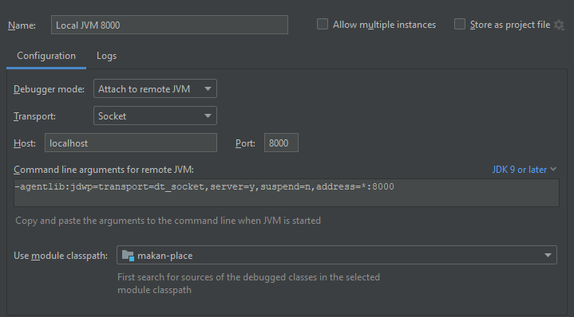

# Makan Place App For Deciding `WHERE TO EAT!?!?`


> [!NOTE]
> To evaluator: Feel free to reach out to me over [LinkedIn](https://www.linkedin.com/in/fucai-ho-22a78156/) if clarifications are needed.
>
## Quick Developer's Notes

The application is a vanilla spring-boot web application and has been tested on [Adoptium JDK21](https://adoptium.net/)

To run, simply:

```shell
mvn spring-boot:run
```

There are various automated tests written:

* Unit Test covering the business rules in the Domain layer
* End to End Integration Test configured with SureFire plug-in to verify implementation specific technicalities

```shell
mvn verify
```

To debug the application (Windows PowerShell):

```shell
mvn spring-boot:run -"Dspring-boot.run.jvmArguments"="-Xdebug -Xrunjdwp:transport=dt_socket,server=y,address=8000,suspend=y"
```

Attach debugger to remote JVM. Example with Intellij:


You can play around with the [Postman Collection](docs/GT%20Makan%20Place.postman_collection.json).

Do note that the APIs are stateful and identify the users based on the session id. See [Functional Design](docs/functional_design.md) 
and [Implementation Details](docs/impl.md).


## Application Design And Considerations

## Links to Sections
1. [Functional Design](docs/functional_design.md)
2. [API Documentation](docs/api.md)
   * [Postman Collection](docs/GT%20Makan%20Place.postman_collection.json) 
3. [Implementation Details](docs/impl.md)
4. [Testing](docs/testing.md)