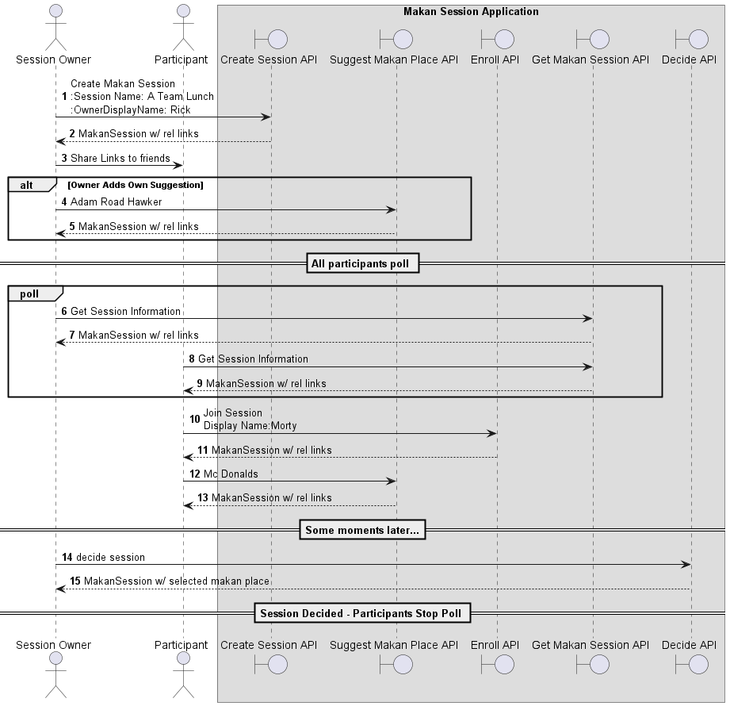

# API Documentation



> __Steps 1 to 3__
> 
> A new makan session is created by the session owner (Rick)

> __Steps 4 to 5__
>
> Owner may optionally add his/her own suggestions

> __Steps 6 to 9__
>
> All interested participants poll the session to get the updates

> __Steps 10 to 11__
>
> Participant Morty enrolls into the session.

> __Steps 12 to 13__
>
> Participant makes his own suggestion.

>  __Steps 14 to 15__
>
> Session owner decides to close the session and a makan place is selected.
 
## Postman Collection

[Here](GT%20Makan%20Place.postman_collection.json)

## Common Response

All APIs invoked will return the view of the `MakanSession` "resource".

### Response Body

The content type is `hal+json`, supporting `rel links`.

```json
{
    "makan_session_id": "16828c85-5272-4114-b0f1-4df7a0c4663d",
    "display_name": "Lunch for Team A",
    "owner_name": "Morty",
    "participants": ["Rick"],
    "suggested_makan_places": [
      {
        "makan_place": "Adam Road Hawker Center",
        "suggester": [
          "Rick"
        ]
      },
      {
        "makan_place": "Mc Donalds",
        "suggester": [
          "Morty"
        ]
      }
    ],
    "state": "ACTIVE",
    "selected_makan_place": { // null if not decided
      "makan_place": "Mc Donalds",
      "suggester": [
        "Morty"
      ]
    },
    "gather_time": "2024-02-27T13:15:45Z",
    "_links": {
        "self": {
            "href": "http://localhost:8080/makan-session/16828c85-5272-4114-b0f1-4df7a0c4663d"
        },
        "enroll": {
            "href": "http://localhost:8080/makan-session/16828c85-5272-4114-b0f1-4df7a0c4663d/enroll"
        },
        "suggest-place": {
            "href": "http://localhost:8080/makan-session/16828c85-5272-4114-b0f1-4df7a0c4663d/suggest-place"
        },
        "decide": {
            "href": "http://localhost:8080/makan-session/16828c85-5272-4114-b0f1-4df7a0c4663d/decide"
        }
    }
}
```

### Response Header

The APIs are stateful as explained in the [design doc](impl.md#user-identification).
As such, the cookie for JSESSIONID will be set.

## Create Makan Session API
Creates a new makan session. As per [functional requirement](functional_design.md):
* If user owns a previous session that is`ACTIVE`, that session will be set to the `ABANDONED` state.
* If user participates in another session that is `ACTIVE`, the user will be removed from that session, along with user's suggestion.

### Request
```
POST http://domain_name/makan-session
```

```json
{
    "user_display_name" : "Session Owner",
    "makan_session_display_name" : "Lunch for Team A",
    "gather_time" : "2024-02-27T13:15:45Z" // ISO-8601 Date Time
}
```

## Get Makan Session API

### Request
```
GET http://domain_name/makan-session/<<makan_session_id>>
```

## Make Suggestion API

### Request
```
POST http://domain_name/makan-session/<<makan_session_id>>/suggest-place
Cookie: JSESSIONID=<session_id>
```

```json
{
  "place_name" : "Adam Road Hawker"
}
```

## Enroll API

Joins a makan session owned by someone else. As per [functional requirement](functional_design.md):
* If user owns a previous session that is`ACTIVE`, that session will be set to the `ABANDONED` state.
* If user participates in another session that is `ACTIVE`, the user will be removed from that session, along with user's suggestion.
### Request
```
POST http://domain_name/makan-session/<<makan_session_id>>/enroll
```

```json
{
  "user_display_name" : "Morty"
}
```

## Decide API

Populates `select_makan_place` and sets status to `DECIDED`.

### Request
```
POST http://domain_name/makan-session/<<makan_session_id>>/decide
Cookie: JSESSIONID=<session_id>
Empty Request Body
```

