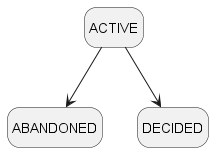

# Functional Design

> [!NOTE]
> Evaluators NOTE:
> 
> The purpose of this section is to demonstrate the requirement analysis process.
> 
> In theory, we should have all the ACs listed. Due to time constraint, this is omitted. 
> 

## Definitions:

A user is said to be `enrolled` in a session when:

- He/She starts one - The user is defined to be a `session owner`
- He/She partiicpates in one - The user is defined to be a `participant`

### Session States

* A session is created in the active state
* A session may be abandoned
* A session can be decided:
    * Once the session owner decides to call it.

## Trade-Offs and Constraints

* We want the application to be easy to use. Akin to joining online collab games where you don't need to login.
    * All that is needed is a user session started and anyone with the link can participate
* A user should only be involved in 1 session at any time
    * How do we rationalise the need for a user to be involved in 2 makan session simultaneously?

## Functionality and Acceptance Criteria

### R1: A user can initiate a session and invite others to join it.

#### AC1 : A new session is created from scratch without any errors.

> **Given**: A user is not enrolled in another session  
> **When**: The user attempts to create a new session.
> * The User provides:
    >   * Display Name of the Session
>   * Display Name of the User
>   * Date Time to meet
>
> **Then**: A new makan session is created:
> * A shareable link is made available for other participants to enrol
> * A link is provided for users to obtain current state of the session

#### AC2: The user is a `session owner` for an on-going session

> **Given**: A user owns an on-going session  
> **When**: The user attempts to create a new session.
> * The User provides:
    >   * Display Name of the User
    >   * Name of the session
>   * Date Time to meet

>
> **Then**: A new makan session is created:
> * A shareable link is made available for other participants to enrol
> * A link is provided for users to obtain current state of the session
> * The on-going session is set to an `ABANDONED` state.

#### AC3: The user is a `particiapnt` in another active session

> **Given**: A user already  participates in another active session  
> **When**: The user attempts to create a new session.
> * The User provides:
    >   * Display Name of the User
    >   * Name of the session
    >   * Date Time to meet
>
> **Then**: A new makan session is created:
> * A shareable link is made available for other participants to enrol
> * A link is provided for users to obtain current state of the session
> * What happens in the active session?
  >   * The user is no longer listed as a participant of the other session.
  >   * The choice submitted by the user is removed

### R2: Users can query the state of a session

#### AC1 : User query a session that exists

> **Given**: A user session `A` exists  
> **When**: The user attempts to retrieve the session `A`  
> **Then**: The session information is returned:
> * State of the session
> * Date time to meet
> *
> * List of participants in the session
> * List of makan places in the session

#### AC2 : User query a session that does not exists

> **Given**: A user session `A` exists  
> **When**: The user attempts to retrieve the session **`B`**  
> **Then**: The user is informed that the session is not found

### R3: A user should be able to join a session.

#### AC1 : User is not enrolled in any other sessions and provides an unique display name
> **Given**: A user is not enrolled in another session  
> **When**: The user attempts to join an existing session A
> * The user provides a display name that is unique to the other participants
>
> **Then**: The makan session is updated with the new participant information

#### AC2 : User is not enrolled in any other sessions and provides a conflicting display name
> **Given**: A user is not enrolled in another session  
> **When**: The user attempts to join an existing session A
> * The user provides a display name that is  not unique to the other participants
>
> **Then**: The user will fail to join the session

#### AC3 : User attempts to join a session that has already completed
> **Given**: A session has already ended (ABANDONED / DECIDED)  
> **When**:  A user attempts to join the session
> **Then**: The user will not be able to do so and an error is returned.

#### AC4 : User is a participant in another session and provides an unique display name
> **Given**: A user is alreadyu enrolled in another session  
> **When**: The user attempts to join an existing session A
> * The user provides a display name that is unique to the other participants
>
> **Then**: The makan session is updated with the new participant information AND  
>   * The user is no longer listed as a participant of the other session.
>   * The choice submitted by the user is removed

### R3: A user should be able to submit suggestions of where to eat.

#### AC1 : User suggests a eating place for session that user is enrolled in

#### AC2 : User suggests a eating place for session that user is NOT enrolled in

#### AC3 : User suggests eating place for a session that has ended

### R4: A session owner should be able to end a session.

#### AC1: Session owner end a session and gets decided makan place

#### AC2: A participant should not be able to end the session.

#### AC3: If a session is ended and there are no suggested places, then the session is deemed to be abandoned.