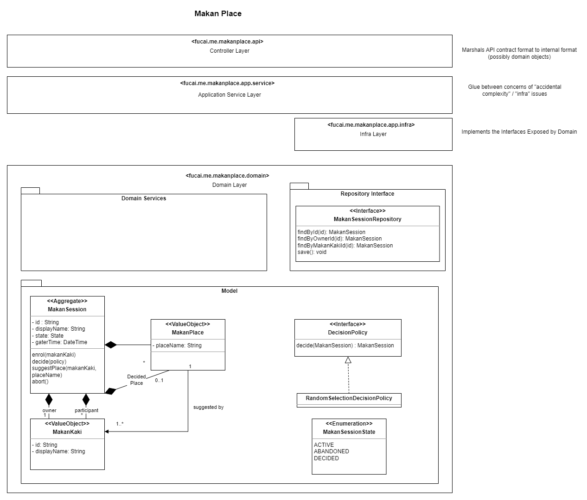

# Implementation Details

## Application Layers



The dependencies in this application points downwards. I.e. the domain layer has no dependencies on the Controller or Application Service layer.

The design takes inspiration from key concepts outlined in [Domain-Driven Design](https://www.oreilly.com/library/view/domain-driven-design-tackling/0321125215/).
* There is an *layered architecture* where :
  * [essential complexity](https://en.wikipedia.org/wiki/No_Silver_Bullet)* is isolated to within the domain layer
    * It becomes technically possible to pull the business logic out of this application without any changes to be **business logic** 
* [Tactical Patterns](https://thedomaindrivendesign.io/what-is-tactical-design/) of DDD are used to organise the rich object model.
  * Business logic and state changes are effected through the aggregate.
  
### Breakdown of Application Layers

#### Controller Layer

This layer contains the API interfaces, the `Spring RestController` mappings and all logic concerning HTTP / Application Layer communication.

> [!NOTE]
> Improvement Point
> 
> The API could be spec-ed with OpenAPI / Swagger. This would make it easier to version control the API and for consumers to generate the stubs.
> Having the interface formally specified also allows the auto-generated stubs to contain regex validation of inputs.
> 
> This is omitted due to time constraints.

#### Application Service Layer

This layer deals with non-essential complexity. I.e. Stuff that doesn't directly involve the business rules. 
Examples would include:
* Marshalling raw data, creating the domain objects and invoking the business rules
* Making calls to enterprise distributed logging for business exceptions that gets propagated upwards

#### Infrastructure Layer

This borrows from the concept of a [hexagonal architecture](https://tsh.io/blog/hexagonal-architecture/). 

The domain layer publishes an interface of the functionality needed for object persistence and/or other external dependencies:
* The infrastructure layer provides the implementation that is then invoked via the domain layer via inversion of dependency.

#### Domain Layer

This layer contains the core business logic.

##### Domain Services

This is not to be confused with Application Services in the [above layer](#application-service-layer).  
Domain services are used to co-ordinate interactions when the desired behaviour cannot be *naturally* fitted onto a single aggregate.
For example, in this application:
* When a [new session is created and a prior one is abandoned](functional_design.md#ac2-the-user-is-a-session-owner-for-an-on-going-session):   
  * A new makan session needs to be created
  * The older makan session needs to have its state updated
  * Having the logic placed in this domain service allows the consuming layer (i.e. the application layer) to not be coupled to this business rule.

##### Domain Model

As previously mentioned, business logic is effected via the Aggregate entity.
This application does not follow the *conventional* [anemic domain model](https://martinfowler.com/bliki/AnemicDomainModel.html) that is rampant in the industry.

As [stateful application](#stateful-application), the user is identified with the `JSESSIONID`.

## Implementation Specifics

### Immutable Objects

All the objects found within the domain layer are immutable.
There are various advantages outlined [here](https://www.leadingagile.com/2018/03/immutable-in-java/).
Specifically, we are able to ensure that the `MakanResource` object is always created in a valid state as the object invariants are enforced within the builder level.
[Example](../src/main/java/fucai/me/makanplace/domain/model/MakanSession.java):
```java
    private static class InvariantEnforcingBuilder extends MakanSession.MakanSessionBuilder {
        // https://ddd-practitioners.com/home/glossary/business-invariant/

        @Override
        public MakanSession build() {
            if (super.state == MakanSessionState.ACTIVE
                    && super.selectedPlace$set && !super.selectedPlace$value.isEmpty()) {
                throw new IllegalStateException(
                        "A session cannot be in the active state and also have a place decided.");
            }
            return super.build();
        }
    }
```


### User Identification

As per [functional requirements](functional_design.md#trade-offs-and-constraints), the application does not deal with authentication the users. 

Instead, users are identified using the session state (this is not a stateless RESTful service).
> [!NOTE]
>  Possible Extension Point
> 
> Modifying this application to account for authenticated session should only affect the controller and application layers.
> 
> For example, instead of using session id, we could have caller applications pass a JWT. The controller layer will then update the 
> logic to identify the user via the credentials specified in the JWT. With JWTs, we could make the application stateless as well.


### Data Persistence

Given that this is a "toy application", the persistence layer is a simple in-memory data store.

> [!NOTE]
>  Constraints
>
> Would have love to implement this with Spring Data JPA. However, I am no longer familiar with it after using 
> proprietary data access frameworks at work for the past few years. I do not have sufficient time to implement this.
> 
> There are a few drawbacks with this. 
> 
> 1. No ACID control, the application at this current state has poor concurrency control.
>    * Fixing this will involve changes at the infra layers

### User Notification

The clients would have to poll the GET endpoint to get the latest updates.

> [!NOTE]
>  Constraints
>
> * Evaluated WebSockets - Am unfamiliar with this and  that would increase complexity given the timeline for coming up with this application.
> * Evaluated long polling with `Spring DeferredResult` - have implemented this previously. Also do not have capacity for this.  
